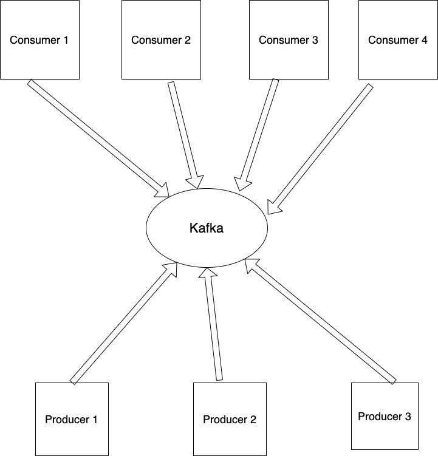

# Simple Kafka Nodejs API

- This API runs a single **Kafka broker** in docker along with other two Services.
- The Services are **Consumer** and **Producer** for simplicity.
- Any additional Services can be added throw:
  1. Define your Service in the `./services` directory along with all its Docker requirements like possible `Dockerfile` etc.
  2. Add an entry in the `docker-compose.yml` for the Service.
  3. Reach the Kafka Broker throw its Container name.



#### Configure:

- The names and ports of the containers can be configured throw the `.env` file to be accessed by all services easily.
- **Note**:
  - `PORT_CONTAINER` stands for the port exposed at the container level. This is the port used by other docker containers to reach the service in the docker network
  - `PORT_HOST` stands for the port exposed at the host level. This is the port used by other services to reach the service in the host level.
  - `KAFKA_ADVERTISED_HOST_NAME` is the ip of your host. make sure to change this based on your ip
- Example:

```
PRODUCER_PORT_CONTAINER=1234
PRODUCER_PORT_HOST=1234

CONSUMER_PORT_CONTAINER=1235
CONSUMER_PORT_HOST=1235

KAFKA_PORT_CONTAINER=9092
KAFKA_PORT_HOST=9095
KAFKA_CONTAINER_NAME=kafka-broker
KAFKA_ADVERTISED_HOST_NAME=192.168.178.38

PRODUCER_CONTAINER_NAME=node-producer
CONSUMER_CONTAINER_NAME=node-consumer
```

#### Producer:

- The Producer provides End points to send Messages to Topics as well as to manage Topics like creating,deleting,listing, etc.

- ###### Topics End Points:

  1. `/topics/getTopics`: Get all the Topics provided by the broker.
  2. `/topics/createTopic`: Creates a topic provided in the request body.

     ```typescript
     { "topic" : "some-topic" }
     ```

  3. `/topics/deleteTopics`: Deletes a topic provided in the request body.

     ```typescript
     { "topic" : "some-topic" }
     ```

  4. `/topics/deleteTopics`: Deletes more than one topic at a time.
     ```typescript
     { "topics" : ["first-topic" , "second-topic"] }
     ```
  5. `/topics/doesTopicExist`: Checks if a topic exists.
     ```typescript
     { "topic" : "some-topic" }
     ```
  6. `/topics/getTopicMetadata`: Getting metadata about a topic
     ```typescript
     { "topic" : "some-topic" }
     ```

- ###### Messages End Points:

  1.  `/message/sendMessage`: Sends a message to a certain topic.
      ```typescript
        {
            "topic": "some-topic",
            "message" : {
                "value" : "message as object"
            }
        }
      ```
      or
      ```typescript
        {
            "topic": "some-topic",
            "message" : "message as string"
        }
      ```
  2.  `/message/broadcastMessage`: Broadcasts the message to all provided topics.
      ```typescript
        {
            "topics": ["first-topic" , "second-topic"]
            "message" : {
                "value" : "message as object"
            }
        }
      ```
  3.  `/message/sendRandomMessage`: Sends a number of random Messages to a topic. for testing how good Kafka handles a big load of messages.

      ```typescript
        {
            "topic" : "some-topic",
            "number":  40
        }
      ```

#### Consumer:

1. `/topics/subscribe`: Subscribes to a topic if it exists.
   ```typescript
   { "topic" : "some-topic" }
   ```

#### Test:

- The file `test.http` contains `HTTP` Request to test the API.
